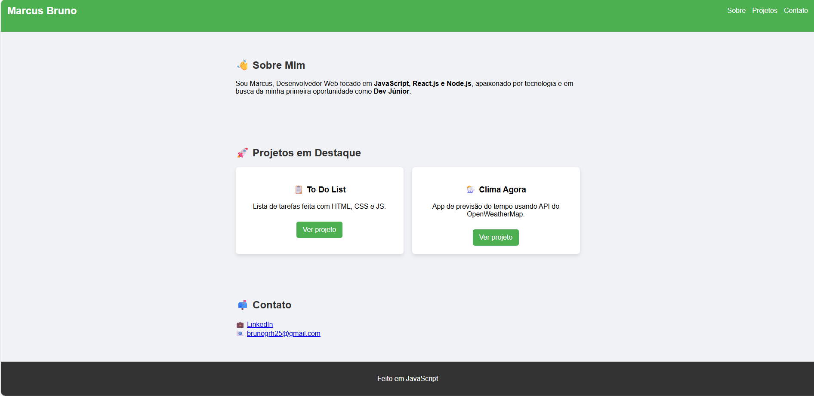

# 🌐 Portfólio Pessoal

Meu portfólio online como Desenvolvedor Web, criado para apresentar meus projetos, tecnologias e formas de contato.  
O site é responsivo e foi desenvolvido com **HTML, CSS e JavaScript**.

🔗 **Acesse o projeto online:**  
👉 [Clique aqui para ver a aplicação](https://marcusdba.github.io/portfolio/) *(link ficará ativo após publicação no GitHub Pages)*

---

## 📸 Demonstração

Veja abaixo uma prévia do portfólio:



---

## 🚀 Seções do Portfólio
- 👋 **Sobre Mim** — breve apresentação profissional  
- 🚀 **Projetos em Destaque** — links para meus principais repositórios (To‑Do List e Clima Agora)  
- 📫 **Contato** — LinkedIn e e-mail para oportunidades  

---

## 🛠️ Tecnologias Utilizadas
- HTML5  
- CSS3  
- JavaScript (Vanilla)  

---

## 📌 Como executar localmente
1. Clone este repositório:
   ```bash
   git clone https://github.com/Marcusdba/portfolio.git
